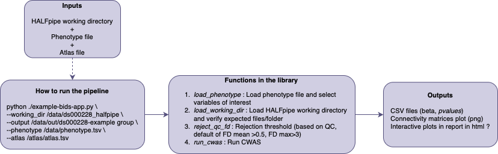

# HALFpipe-cwas

## 📚 Background 
The reproducibility crisis in neuroimaging has affected many research domains, and psychiatric research is no exception [1](https://doi.org/10.1016/j.bpsc.2022.12.006). Indeed, psychiatric studies using neuroimaging tools have long struggled with poor reproducibility, largely due to small sample sizes and heterogeneity in analysis methods.

To address this issue, initiatives such as the ENIGMA consortium (Enhancing NeuroImaging Genetics through Meta-Analyses) were launched [2](https://doi.org/10.1007/s11682-013-9269-5). ENIGMA is a consortium comprising numerous research sites and organized into several Disease Working Groups that focus on most major psychiatric conditions. It promotes a collaborative framework: while data remain at local sites, analyses follow standardized protocols, enabling large-scale meta-analyses across cohorts.

This approach has proven successful for structural and diffusion MRI, thanks to the development of open and reproducible protocols (https://enigma.ini.usc.edu/protocols/). In this context, Waller et al., 2020 developed HALFpipe [3](https://doi.org/10.1002/hbm.25829), an open-source software that facilitates the preprocessing and extraction of connectivity matrices from functional MRI data. However, no standard tools has yet been proposed by ENIGMA for statistical analyses of functional connectivity matrices.

## 🎯 Objectives
### Main objectives
This project aims to support the broader collaborative effort by developing a dedicated library for conducting Connectome-Wide Association Studies (CWAS) based on connectivity matrices generated by HALFpipe.

In the long term, this library could be integrated into existing tools such as HALFpipe or the ENIGMA Toolbox, ensuring sustainability and continued maintenance.

### Objectives for BrainHack school
Learn how to : 
1. Write scripts in python following the BIDS-app workflow
2. Build a GitHub repository with automated tests with GitHub Actions
3. Develop a sustainable and easy-to-use python package with pipy
4. Produce interactive plots and interactive website ✨
 
 *Proposed Pipeline Structure (Subject to Change)*

## 🧰 Tools 
This project uses the following tools and standards to ensure reproducibility, openness, and long-term usability:
- **Datalad** : To download datasets with specific versions or subsets of a datasets
- **Git & GitHub**: 
   - Enables version control and promotes open-source, collaborative development of the library.
   - Implements automated testing and continuous integration to maintain code quality during development (Git Actions).
- **BIDS Ecosystem**: Ensures compatibility with the BIDS standard, following the workflow of a BIDS App ([4](https://doi.org/10.1371/journal.pcbi.1005209)).
- **Python Packaging with pipy**: Distributes the tool as an installable open-source Python library for easy integration and reuse.
- **Container (Docker)**: Ensures cross-platform compatibility and promotes reproducible research.
- Interactive documentation : Provides runnable examples directly on the website for users to test and explore.
   - **Plots with Plotly**
   - **Website with MyST or Sphynx**

## 🧠 Data 
To test each function, toy data will be generated.

To test on real data, a subset of preprocessed data with HALFpipe from the [UCLA Consortium for Neuropsychiatric Phenomics LA5c Study (ds000030)](https://openneuro.org/datasets/ds000030/versions/00016) might be used.
   
## 🗓️ Deliverables 
*Code development:*
- Python scripts with functions to perform the CWAS
- A GitHub action repository that automatically test new request from users
- A python package ready to be used
- A Container

*Documentation:*
- A Jupyter Notebook with a tutorial 
- A website with 
   - documentation to run and install the Library
   - interactive notebooks & plots

## 📖 References
1. 	Botvinik-Nezer R, Wager TD. Reproducibility in neuroimaging analysis: Challenges and solutions. Biol Psychiatry Cogn Neurosci Neuroimaging. 2023;8: 780–788.
2. 	Thompson PM, Stein JL, Medland SE, Hibar DP, Vasquez AA, Renteria ME, et al. The ENIGMA Consortium: large-scale collaborative analyses of neuroimaging and genetic data. Brain Imaging Behav. 2014;8: 153–182.
3. 	Waller L, Erk S, Pozzi E, Toenders YJ, Haswell CC, Büttner M, et al. ENIGMA HALFpipe: Interactive, reproducible, and efficient analysis for resting-state and task-based fMRI data. Hum Brain Mapp. 2022;43: 2727–2742.
4. 	Gorgolewski KJ, Alfaro-Almagro F, Auer T, Bellec P, Capotă M, Chakravarty MM, et al. BIDS apps: Improving ease of use, accessibility, and reproducibility of neuroimaging data analysis methods. PLoS Comput Biol. 2017;13: e1005209.

## ✨ Aknowledgements
This library will be based on previous published code by Dr. Clara A. Moreau. 

The original version of the scripts can be found here : https://github.com/claramoreau9/NeuropsychiatricCNVs_Connectivity