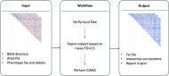

# CWAS-rsfMRI

The main goal of the `cwas-rsfmri` pipeline is to provide a easy and semi-flexible workflow to perform Connectome Wide Association Study (CWAS) on fmri connectivity matrix.
This app follows a BIDS-App workflow.

## 📌 Documentation
###  How to run the pipeline 
First you need to clone the repository
```
git clone https://github.com/brainhack-school2025/elkhantour_project.git
```

Then install the package

```
pip install -e .
```
### Example usage
```bash
cwas-rsfmri --bids_dir=bids_directory \
--output_dir=results \
--atlas_file=atlas.txt \
--atlas=example_atlas \
--phenotype_file=participants.tsv \
--group=diagnosis \
--case_id=NDD \
--control_id=HC \
--session=timepoint1 \
--task=task01 \
--run=01 \
--feature=denoiseSimple
```
### For more information
For more info on all settings available, run `cwas-rsfmri --help`
- [Installation instruction](docs/pages/01.install/index.md)
- [Usage](docs/pages/02.flags/index.md)

## Workflow


## Advantages
- Standardized format (BIDS).
- Easy to use (1 command line).
- Ready to use outputs.
- Flexible covariates.
- Complete reports in json file format.
- Interactive plot in html.