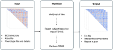

# Welcome to CWAS-rsfmri ! 🚀

The main goal of the `cwas-rsfmri` pipeline is to provide a easy and semi-flexible workflow to perform Connectome Wide Association Study (CWAS) on fmri connectivity matrix.

This app follows a BIDS-App workflow.

